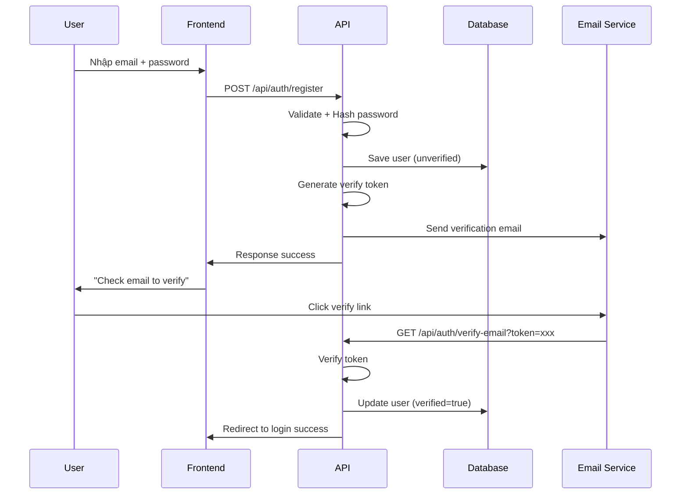
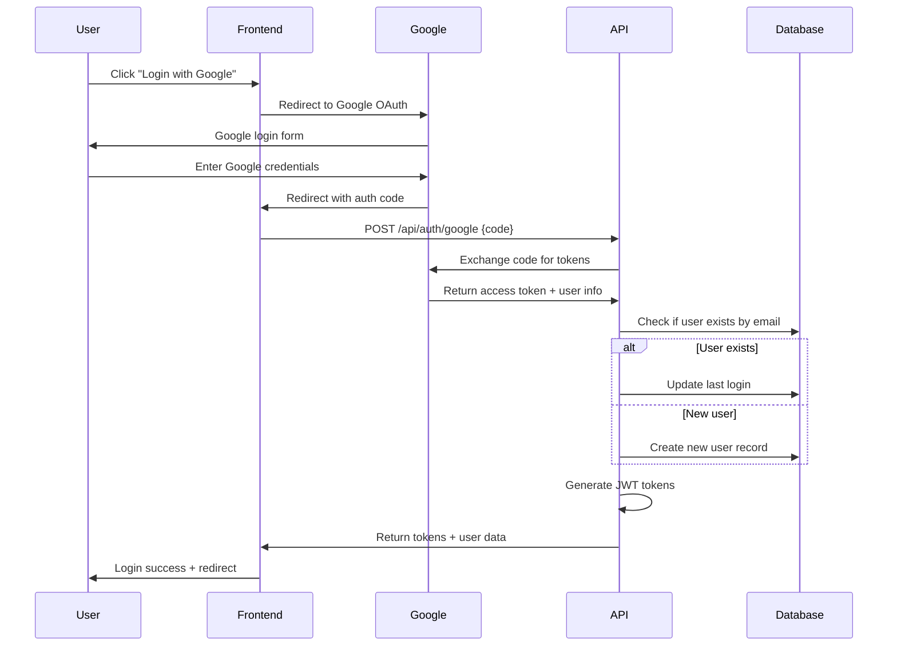
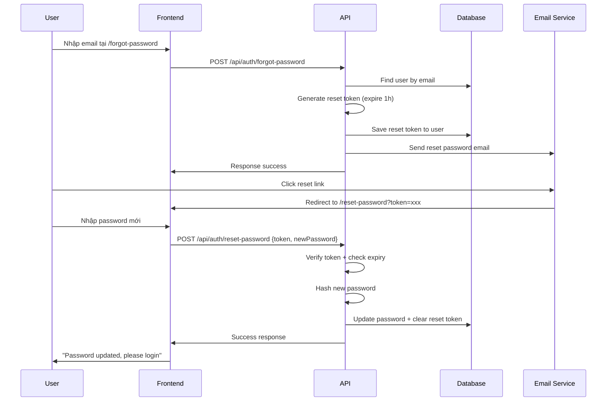
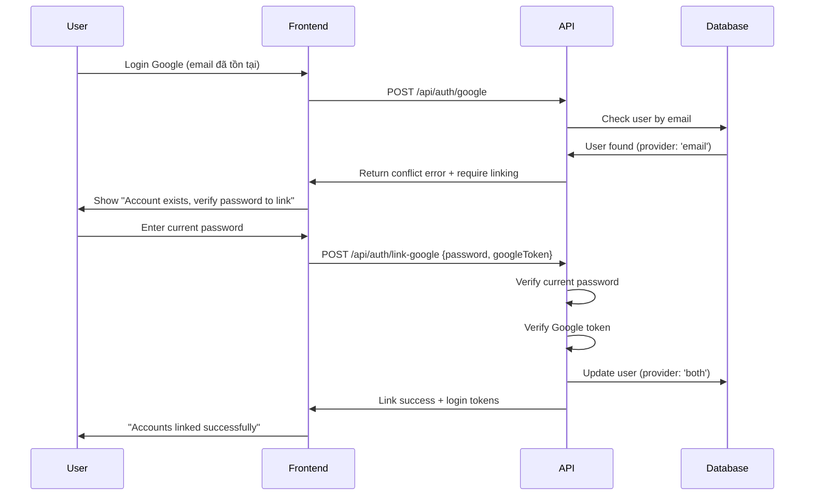

# 🎯 holablog PROJECT - BUSINESS LOGIC & REQUIREMENTS

**Ngày cập nhật**: August 12, 2025  
**Phiên bản**: 2.0.0  
**Trạng thái**: Development Phase  

## 📋 TỔNG QUAN DỰ ÁN

**Mục tiêu**: Xây dựng hệ thống blog cá nhân API-first với kiến trúc hiện đại, khả năng mở rộng cao và tích hợp các dịch vụ bên thứ ba.

**Triết lý thiết kế**: 
- 🎯 **Tối giản**: Chỉ xây dựng những tính năng thực sự cần thiết
- ⚡ **Hiệu quả**: Tận dụng dịch vụ bên thứ ba chuyên biệt 
- 🔧 **Linh hoạt**: Dễ dàng mở rộng và bảo trì
- 🛡️ **Bảo mật**: Áp dụng best practices về security

**Người vận hành**: Solo developer (vừa là developer vừa là content admin)

## 👥 HỆ THỐNG VAI TRÒ & QUYỀN HẠN

### 🔐 3 CẤP ĐỘ TRUY CẬP

| Vai trò | Mô tả | Quyền hạn chính |
|---------|-------|-----------------|
| **🛡️ Admin** | Solo developer/owner của blog | • Toàn quyền quản trị hệ thống<br>• CRUD posts, comments, users<br>• Quản lý media upload<br>• Cấu hình hệ thống |
| **👤 User/Subscriber** | Độc giả đã đăng ký (Google/Email) | • Đăng bình luận có danh tính<br>• Lưu bài viết yêu thích<br>• Quản lý profile cơ bản |
| **👁️ Guest** | Khách vãng lai (chưa đăng nhập) | • Chỉ đọc nội dung công khai<br>• Không được bình luận<br>• Không có tương tác |

### 🎯 BUSINESS RULES

1. **Chỉ Admin** được tạo/sửa/xóa posts
2. **User** phải verify email mới được comment  
3. **Guest** chỉ có quyền đọc, không tương tác
4. **Mỗi email** chỉ có 1 account duy nhất
5. **Account linking** khi user đăng ký cả email/password và Google## 🏗️ KIẾN TRÚC & CÔNG NGHỆ CORE

### 📐 Kiến trúc: API-First (Headless CMS)

```
┌─────────────────┐    HTTP/REST API    ┌─────────────────┐
│   Frontend      │ ◄─────────────────► │   Backend       │
│   (Next.js)     │                     │   (Express/Bun) │
│   Port: 3001    │                     │   Port: 3000    │
└─────────────────┘                     └─────────────────┘
                                                │
                                                ▼
                                        ┌─────────────────┐
                                        │   MySQL DB      │
                                        │   (Docker)      │
                                        │   Port: 3306    │
                                        └─────────────────┘
```

**Lợi ích**:
- ✅ Frontend/Backend độc lập, dễ scale
- ✅ API có thể phục vụ mobile app sau này  
- ✅ SEO-friendly với Next.js SSR
- ✅ Deployment linh hoạt

### 🔐 HỆ THỐNG XÁC THỰC (DUAL LOGIN)

#### 🎯 PHƯƠNG THỨC ĐĂNG NHẬP SONG SONG

1. **🔵 Google OAuth (Khuyến khích)**
   - Đăng nhập 1-click, không cần mật khẩu
   - Tự động lấy name, email, avatar từ Google
   - Bảo mật cao, Google quản lý authentication

2. **📧 Email/Password (Truyền thống)**
   - Đăng ký: email + password + verify email
   - Đăng nhập: email + password  
   - Forgot password: reset qua email
   - Password BẮT BUỘC hash bằng bcrypt

#### 🔒 SECURITY REQUIREMENTS

| Yêu cầu | Mô tả | Trạng thái |
|---------|-------|------------|
| **Password Hashing** | bcrypt với salt rounds ≥ 12 | ✅ Bắt buộc |
| **JWT Tokens** | Access (15m) + Refresh (7d) | ✅ Bắt buộc |
| **Email Verification** | Verify email sau register | ✅ Bắt buộc |
| **Rate Limiting** | Limit login attempts | ✅ Khuyến khích |
| **HTTPS Only** | Secure cookies, HTTPS redirect | ✅ Production |

### 🔌 DỊCH VỤ TÍCH HỢP BÊN THỨ BA

| Dịch vụ | Mục đích | Provider Options | Trạng thái |
|---------|----------|------------------|------------|
| **🔐 OAuth** | Google Authentication | Google OAuth 2.0 | Required |
| **🖼️ Media Storage** | Upload images/files | Cloudinary | Required |
| **📧 Email Service** | Verify email, reset password | SendGrid/Mailgun/AWS SES | Required |
| **📊 Analytics** | Traffic monitoring | Google Analytics (optional) | Optional |

## 🚀 TÍNH NĂNG CHÍNH & API ENDPOINTS

### 🔧 BACKEND API (Express + TypeScript + Bun)

#### 🔐 Authentication Module
```http
POST   /api/auth/register          # Đăng ký email/password
POST   /api/auth/login             # Đăng nhập email/password  
POST   /api/auth/google            # Đăng nhập/đăng ký Google
POST   /api/auth/forgot-password   # Gửi email reset password
POST   /api/auth/reset-password    # Reset password từ email
GET    /api/auth/verify-email      # Verify email từ link
POST   /api/auth/refresh           # Refresh access token
POST   /api/auth/logout            # Logout & invalidate tokens
```

#### 📝 Content Management (Admin Only)
```http
GET    /api/posts                  # List posts (public + admin)
POST   /api/posts                  # Create post (Admin only)
GET    /api/posts/:id              # Get single post  
PUT    /api/posts/:id              # Update post (Admin only)
DELETE /api/posts/:id              # Delete post (Admin only)

GET    /api/categories             # List categories
POST   /api/categories             # Create category (Admin only)

GET    /api/tags                   # List tags
POST   /api/tags                   # Create tag (Admin only)
```

#### 💬 Comment System (User + Admin)
```http
GET    /api/posts/:id/comments     # Get comments for post
POST   /api/posts/:id/comments     # Add comment (User/Admin)
PUT    /api/comments/:id           # Edit comment (Owner/Admin)
DELETE /api/comments/:id           # Delete comment (Owner/Admin)
```

#### 🖼️ Media Management (Admin Only)
```http
POST   /api/media/signature        # Get Cloudinary upload signature
GET    /api/media                  # List uploaded media
DELETE /api/media/:id              # Delete media file
```

#### 👤 User Management
```http
GET    /api/users/profile          # Get own profile (User/Admin)
PUT    /api/users/profile          # Update own profile (User/Admin)
GET    /api/users                  # List all users (Admin only)
DELETE /api/users/:id              # Delete user (Admin only)
```

### 🌐 FRONTEND WEB APP (Next.js App Router)

#### 📱 Public Pages (Guest Access)
```
/                                  # Homepage với latest posts
/posts                            # Posts listing với pagination  
/posts/[slug]                     # Single post detail
/categories/[slug]                # Posts by category
/tags/[slug]                      # Posts by tag
/search?q=keyword                 # Search posts
/about                            # About page
```

#### 🔐 Auth Pages
```
/auth/login                       # Login form (Email + Google)
/auth/register                    # Register form (Email)
/auth/forgot-password             # Forgot password form
/auth/reset-password?token=...    # Reset password form
/auth/verify-email?token=...      # Email verification handler
```

#### 🛡️ Protected Pages (User/Admin)
```
/profile                          # User profile management
/profile/comments                 # User's comments history
/profile/favorites                # Saved posts (future)
```

#### ⚙️ Admin Dashboard (Admin Only)
```
/admin                            # Admin dashboard overview
/admin/posts                      # Posts management
/admin/posts/new                  # Create new post
/admin/posts/[id]/edit           # Edit existing post  
/admin/comments                   # Comments moderation
/admin/users                      # Users management
/admin/media                      # Media library
/admin/settings                   # Site settings
```

## 🔄 LUỒNG HOẠT ĐỘNG QUAN TRỌNG (CRITICAL WORKFLOWS)

### 📝 1. LUỒNG ĐĂNG KÝ EMAIL/PASSWORD



**Chi tiết bước**:
1. User nhập email + password tại `/auth/register`
2. Frontend validate form + gửi API `POST /api/auth/register`
3. Backend validate + hash password bằng bcrypt
4. Lưu user vào DB với `emailVerified: false`
5. Generate JWT verification token (expire 24h)
6. Gửi email chứa link verify: `/auth/verify-email?token=xxx`
7. User click link verify → Backend update `emailVerified: true`

### 🔐 2. LUỒNG ĐĂNG NHẬP GOOGLE OAUTH



**Chi tiết bước**:
1. User click "Đăng nhập với Google"
2. Redirect đến Google OAuth consent screen
3. User authorize → Google trả về authorization code
4. Frontend gửi code tới `POST /api/auth/google`
5. Backend exchange code lấy user info từ Google
6. Kiểm tra email đã tồn tại chưa:
   - **Nếu có**: Update last login
   - **Nếu chưa**: Tạo user mới với `provider: 'google'`
7. Generate JWT access + refresh tokens
8. Return tokens + user data

### 🔄 3. LUỒNG QUÊN & ĐẶT LẠI MẬT KHẨU



### ⚠️ 4. LUỒNG ACCOUNT LINKING (QUAN TRỌNG)

**Tình huống**: User đã có account Email/Password, sau đó thử đăng nhập Google cùng email



**Business Logic**:
- Nếu email đã tồn tại với `provider: 'email'`
- Yêu cầu user nhập password hiện tại để verify
- Sau khi verify → Update `provider: 'both'`
- User có thể login bằng cả 2 cách

### 🔒 5. JWT TOKEN MANAGEMENT

**Token Strategy**:
- **Access Token**: 15 phút, chứa user info + permissions
- **Refresh Token**: 7 ngày, stored in HttpOnly cookie
- **Verification Token**: 24 giờ, cho email verification
- **Reset Token**: 1 giờ, cho password reset

**Refresh Flow**:
```
Access token hết hạn → Frontend gọi /api/auth/refresh
→ Backend verify refresh token → Issue new access token
→ Frontend retry original request với token mới
```

---

## 📊 DATABASE SCHEMA & RELATIONSHIPS

### 🗄️ CORE TABLES

```sql
-- Users table (Authentication & Profile)
users {
  id: varchar(36) PRIMARY KEY           -- UUID
  email: varchar(255) UNIQUE NOT NULL   
  password: varchar(255) NULL           -- NULL for Google-only users
  name: varchar(100) NOT NULL
  avatar: varchar(500) NULL             -- Cloudinary URL or Google avatar
  role: enum('admin', 'user') DEFAULT 'user'
  provider: enum('email', 'google', 'both') DEFAULT 'email'
  emailVerified: boolean DEFAULT false
  googleId: varchar(255) NULL UNIQUE    -- Google user ID
  resetToken: varchar(255) NULL         -- Password reset token
  resetTokenExpiry: datetime NULL
  verifyToken: varchar(255) NULL        -- Email verification token  
  verifyTokenExpiry: datetime NULL
  lastLoginAt: datetime NULL
  createdAt: datetime DEFAULT CURRENT_TIMESTAMP
  updatedAt: datetime DEFAULT CURRENT_TIMESTAMP ON UPDATE CURRENT_TIMESTAMP
}

-- Posts table (Blog content)
posts {
  id: varchar(36) PRIMARY KEY
  title: varchar(255) NOT NULL
  slug: varchar(255) UNIQUE NOT NULL    -- URL-friendly slug
  content: longtext NOT NULL            -- Markdown content
  excerpt: text NULL                    -- Short description
  featuredImage: varchar(500) NULL     -- Cloudinary URL
  status: enum('draft', 'published', 'archived') DEFAULT 'draft'
  authorId: varchar(36) NOT NULL        -- Always admin user
  publishedAt: datetime NULL
  createdAt: datetime DEFAULT CURRENT_TIMESTAMP
  updatedAt: datetime DEFAULT CURRENT_TIMESTAMP ON UPDATE CURRENT_TIMESTAMP
  
  FOREIGN KEY (authorId) REFERENCES users(id) ON DELETE CASCADE
}

-- Categories & Tags for organization
categories {
  id: varchar(36) PRIMARY KEY
  name: varchar(100) NOT NULL UNIQUE
  slug: varchar(100) NOT NULL UNIQUE
  description: text NULL
}

tags {
  id: varchar(36) PRIMARY KEY  
  name: varchar(50) NOT NULL UNIQUE
  slug: varchar(50) NOT NULL UNIQUE
}

-- Comments table (User interactions)
comments {
  id: varchar(36) PRIMARY KEY
  content: text NOT NULL
  authorId: varchar(36) NOT NULL        -- User who commented
  postId: varchar(36) NOT NULL          -- Post being commented on
  parentId: varchar(36) NULL            -- For nested replies
  status: enum('pending', 'approved', 'rejected') DEFAULT 'approved'
  createdAt: datetime DEFAULT CURRENT_TIMESTAMP
  
  FOREIGN KEY (authorId) REFERENCES users(id) ON DELETE CASCADE
  FOREIGN KEY (postId) REFERENCES posts(id) ON DELETE CASCADE  
  FOREIGN KEY (parentId) REFERENCES comments(id) ON DELETE CASCADE
}
```

### 🔗 RELATIONSHIPS
- `users (1) ──── (∞) posts` (Admin creates posts)
- `users (1) ──── (∞) comments` (Users comment)  
- `posts (1) ──── (∞) comments` (Posts have comments)
- `posts (∞) ──── (∞) categories` (Many-to-many)
- `posts (∞) ──── (∞) tags` (Many-to-many)

---

## 🎯 BUSINESS PROBLEMS SOLVED

### 💼 CORE PROBLEMS
1. **Personal Branding**: Professional blog showcase expertise
2. **Content Management**: Easy article publishing & management  
3. **Reader Engagement**: Comment system build community
4. **SEO Optimization**: Search-friendly URLs & meta tags
5. **Security**: Safe authentication without storing sensitive data
6. **Scalability**: API-first architecture cho future expansion
7. **Maintenance**: Minimal server management với cloud services

### 🎯 TARGET AUDIENCE
- **Primary**: Developers, tech professionals
- **Secondary**: Recruiters, potential clients
- **Admin**: Solo developer (content owner)

### 📈 SUCCESS METRICS  
- **Engagement**: Comments, time on page
- **Growth**: Monthly visitors, email subscribers
- **Performance**: Page load speed, uptime
- **SEO**: Search ranking for target keywords
- **Security**: Zero incidents, successful auth flows

---

**📝 Note for AI Assistants**: Document này provide complete business logic và technical requirements. Khi implement features, refer document này để ensure consistency với overall project vision.

**Last Updated**: August 12, 2025  
**Version**: 2.0.0  
**Status**: Ready for Development 